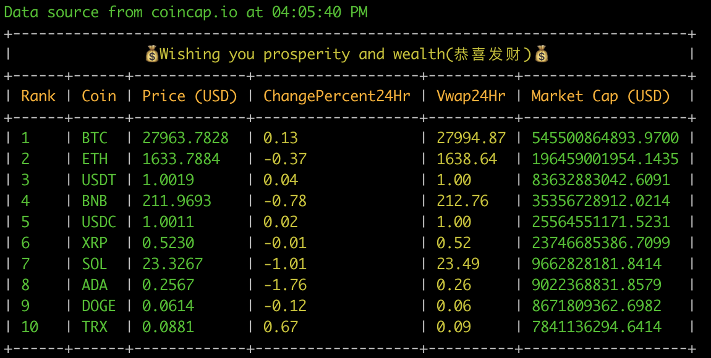

# BladeCoin

command line coin

## Installation

    $ gem install blade_coin

## Usage

To check the top 10 cryptocurrencies ranked by their market cap, simply enter
```
$ coin
```

Result Output Example:



## Options

### Find specific coin(s)

like `btc`

```
coin btc
```

result:
```
BTC_USDT
66065.69
```

### Find top coin(s)

You can use the `-t` (or `--top`) with the index to find the top n cryptocurrencies ranked by their market cap.

```
$ coin -t 50 // find top 50
```

### CLI

You can quickly query the symbol you want to search for

```
coin-cli
```

### Show option menu

You can use the `-h` (or `--help`) to find all valid options of coin

```
$ coin -h
```

## Contributing

Bug reports and pull requests are welcome on GitHub at https://github.com/gith-u-b/blade_coin. This project is intended to be a safe, welcoming space for collaboration, and contributors are expected to adhere to the [Contributor Covenant](http://contributor-covenant.org) code of conduct.

## License

The gem is available as open source under the terms of the [MIT License](https://opensource.org/licenses/MIT).
